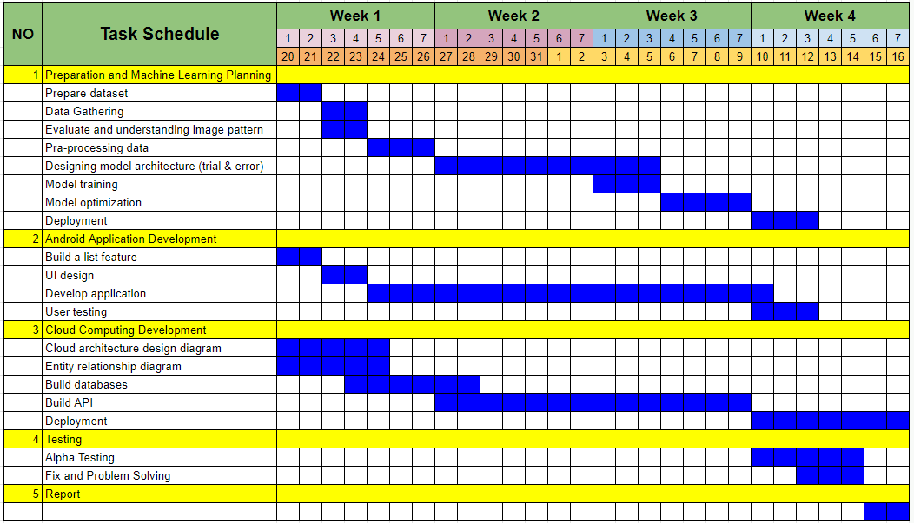

# Local.Ind

**Group ID:** C241-PS127

## Team Members
- **(ML) M446D4KY2148:** Fajar Agim Sumarna – Universitas Kebangsaan Republik Indonesia
- **(ML) M004D4KX2544:** Bintang Bakkara – Institut Teknologi Sepuluh Nopember
- **(ML) M009D4KY2782:** Muhammad Hauzan Dini Fakhri – University of Gunadarma
- **(CC) C009D4KY0607:** Fadhil Muhammad – University of Gunadarma
- **(CC) C004D4KY0700:** Yoga Hartono – Institut Teknologi Sepuluh Nopember
- **(MD) A009D4KY3641:** Muhamad Rezqi Septiandri Putra – University of Gunadarma
- **(MD) A548D4NY4634:** Zildan Pandaru Sih Marginata – Universitas Islam Negeri Sunan Kalijaga

## Abstract
To address the preference of 60% of Indonesians for foreign products, as reported by CNBC Indonesia, the development of an e-commerce platform supporting local fashion brands is essential. By leveraging technology and digital connectivity, such a platform can introduce, market, and support local products to domestic consumers, enhancing market reach and fostering appreciation for Indonesia's cultural diversity. User-friendly Local.Ind platforms, offering trusted transactions and innovations like digital payment systems, recommendation algorithms, and object detection, will facilitate the discovery and purchase of local products, contributing to a more inclusive and sustainable digital economy ecosystem in Indonesia.

## Project Goal
Develop and launch **Local.Ind**, an e-commerce platform aimed at promoting local fashion brands in Indonesia, bridging the gap between consumer preferences and local offerings, while enhancing market visibility and cultural appreciation within a one-month timeframe.

## Timelines

## Deliverables
### Mobile Development (MD)
- **Create Flowchart for Application:** 2 days
- **Create Wireframe Application:** 2 days
- **Development Application:** 18 days
- **Testing Application:** 5 days

### Cloud Computing (CC)
- **Cloud Architecture Design Diagram:** 5 days
- **Entity Relationship Diagram:** 5 days
- **Build Database:** 6 days
- **Build Backend:** 12 days
- **Deployment:** 7 days

### Machine Learning (ML)
- **Prepare dataset & data gathering:** 3 days
- **Preprocessing & cleaning data:** 4 days
- **Modelling:** 10 days
- **Optimization:** 4 days
- **Deployment & Integration:** 3 days

### All Teams
- **Report:** 2 days

## Scope
- Smart Recommender System
- Product Search Feature
- Category System
- Community Empowerment

## Out of Scope
- Customization of individual user profiles beyond basic registration information.
- Integration with external social media platforms for sharing user activities or purchases.
- Implementation of advanced virtual try-on or augmented reality features for product visualization.
